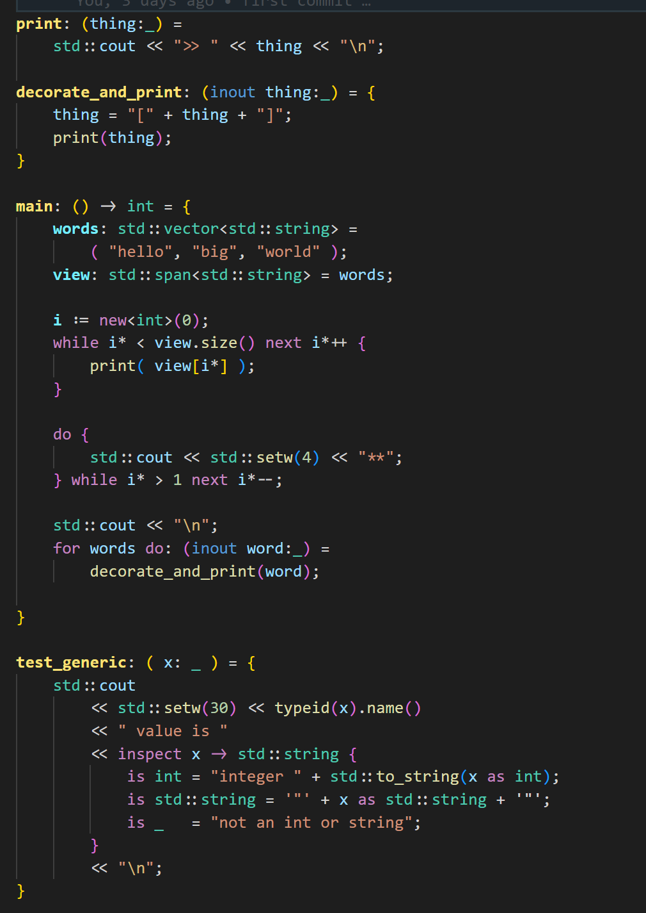

# [cpp2 (cppfront)](https://github.com/hsutter/cppfront) Syntax Highlighting for VSCode

This extension provides syntax highlighting for the experimental [cpp2](https://github.com/hsutter/cppfront) language.

It support most of the pure-cpp2 grammar to date (new syntax since last version is still on-going).

It supports highlighting of plain C++ in cpp2 source code, but we have to mark the C++ block with a special comment:
    
```cpp
/* lang:cpp */
int main() {
    return 0;
}
/* lang:end */
```

For any issues, please file them on the [GitHub repo](https://github.com/elazarcoh/cpp2-syntax).



## Build

```bash
yarn install
yarn run build
yarn run package
```

The output VSIX file is located under `cpp2`.
